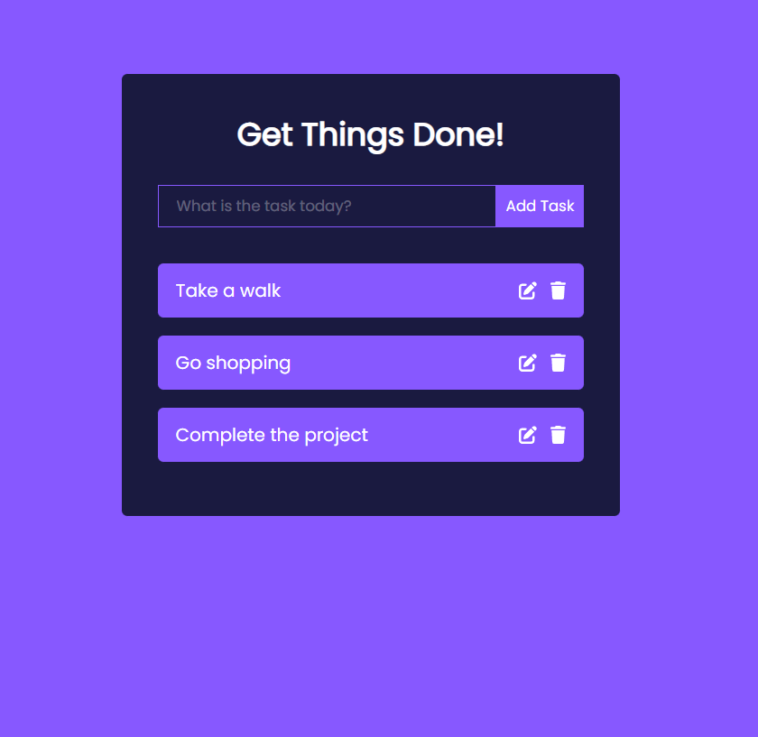

<br/>
<p align="center">
  <h3 align="center">Todo List App</h3>

</p>

      


## About The Project

This project has been developed to help users plan and replace some tasks in their daily life as a reminder. You can add the tasks that you need to complete during the day to the list. You can delete tasks you stopped doing, update tasks you want to change, and strikethrough tasks you have completed.

## Built With

While developing this project, JavaScript was used as the programming language. It was written in ECMAScript 6 and above standards and developed with a functional programming paradigm. Work has been done on the component architecture with the React library and also "id" values have been assigned to each object to be used in the project by using the UUID (Universal Unique Identifier) package. While developing the interface, HTML5 and CSS3 technologies were used, and the positions of the elements on the screen were determined with the flexbox feature. In addition to these, he used "Font Awesome" icons while shaping some of the buttons.

* [React](https://react.dev/)
* [CSS3 flexbox](https://css-tricks.com/snippets/css/a-guide-to-flexbox/)
* [Font Awesome](https://fontawesome.com/)

## Getting Started

This is an example of how you may give instructions on setting up your project locally.
To get a local copy up and running follow these simple example steps.

### Prerequisites

This is an example of how to list things you need to use the software and how to install them.

* npm

```sh
npm install npm@latest -g
```

### Installation

1. Clone the repo

```sh
git clone https://github.com/your_username_/Project-Name.git
```

. Install NPM packages

```sh
npm install
```

4. Run the project

```JS
npm start
```


